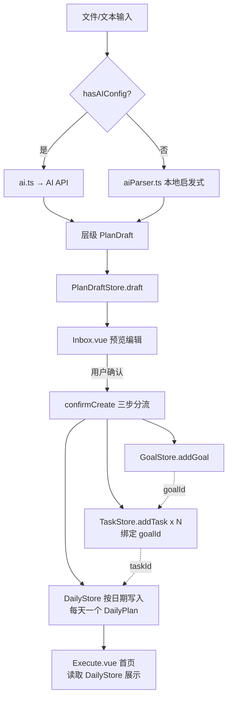

# P17 AI 计划解析升级为层级计划系统

## 需求提炼

**用户原话目标**：文件解析后直接生成大量 Task，导致任务数量爆炸、没有目标、没有日期层级、首页无法展示。需要增加中间层。

**核心诉求**：
1. 解析产物是层级结构（Goal → Days → Blocks → Tasks），不是扁平任务列表
2. AI 生成后进入 PlanDraft，禁止直接创建 Task
3. 确认创建时分流到三个 Store（GoalStore / TaskStore / DailyStore），任务绑定 goalId
4. AI 生成内容必须分类过滤（任务/说明/复盘模板），只有任务进入 Task
5. 验收：导入"第1周前端就业冲刺计划"应生成 1 个目标 + 7 个每日计划 + 每天约 5 个任务，而不是 100 多个任务

**非目标**：
- 不改 DailyPlan 的现有数据结构（`{ date, taskIds, habitIds, summary }` 保持不变）
- 不改 Goal / Task 的现有接口字段
- 不改首页（Execute.vue）的任务展示逻辑——首页已经正确读取 DailyStore

## 现状诊断

代码库存在 **两套不兼容的 PlanDraft 定义**和 **三个解析器**，且 Inbox.vue 引用了 store 中不存在的 API：

| 来源 | 形态 | 消费者 |
|------|------|--------|
| `src/mock/planDraft.ts` | `{ id, source, title, goal, tasks:[{id,title,priority,selected,dueDate}], schedule, summary }` | src/services/aiParser.ts、src/stores/planDraft.ts、src/views/Inbox.vue |
| `src/stores/plans.ts` | `{ planId, goalTitle, goalDescription, startDate, endDate, totalDays, tasks:[{title,day,date,time,priority}], rawContent }` | src/services/ai.ts、src/services/planParser.ts |

Inbox.vue 调用 `draftStore.currentDraft`（store 未导出该 ref，内部名为 `draft`）和 `draftStore.createFromAI()`（store 中不存在该方法）——当前代码处于编译不通过的断裂状态。

## 统一层级模型设计

新建 `src/types/planDraft.ts`（新增）作为唯一类型源，取代上述两套定义：

```typescript
// src/types/planDraft.ts — 唯一 PlanDraft 类型定义

export type Priority = 'high' | 'medium' | 'low'
export type ContentCategory = 'task' | 'note' | 'review'  // AI 内容分类过滤

/** 草稿中的任务（最底层） */
export interface DraftTask {
  id: string
  title: string
  priority: Priority
  selected: boolean          // 用户可勾选/取消
  category: ContentCategory  // AI 分类标记：只有 'task' 才进入 TaskStore
}

/** 时间块（中间层：学习/项目/复盘等） */
export interface DraftBlock {
  id: string
  category: string           // '学习' | '项目' | '复盘' | '其他'
  time?: string              // 'HH:MM' 可选
  tasks: DraftTask[]
}

/** 每日计划（Day 层） */
export interface DraftDay {
  id: string
  day: number                // 第几天（1-based）
  date: string               // YYYY-MM-DD
  title: string              // 如 "Day1：认识项目结构"
  blocks: DraftBlock[]
}

/** PlanDraft（顶层：目标 + 天） */
export interface PlanDraft {
  id: string
  source: 'file' | 'text' | 'image'
  goal: {
    title: string
    description: string
  }
  days: DraftDay[]
  startDate: string
  totalDays: number
  createdAt: string
}

/** 便捷计算：草稿中所有任务的扁平视图 */
export function flattenTasks(draft: PlanDraft): DraftTask[] {
  return draft.days.flatMap(d => d.blocks.flatMap(b => b.tasks))
}

/** 便捷计算：某一天的所有任务 */
export function dayTasks(draft: PlanDraft, day: number): DraftTask[] {
  return draft.days.find(d => d.day === day)?.blocks.flatMap(b => b.tasks) || []
}
```

数据流：



## 解析器适配方案

三个解析器统一输出新的 `PlanDraft`（层级结构），内部各自保留解析策略但返回类型对齐。

### 1. `src/services/ai.ts`（AI API 路径）— 改 SYSTEM_PROMPT + 输出结构

**SYSTEM_PROMPT** 增加层级 JSON 结构要求：

```
输出格式：
{
  "goalTitle": "目标名称",
  "goalDescription": "一句话描述",
  "totalDays": 7,
  "days": [
    {
      "day": 1,
      "title": "Day1：认识项目结构",
      "blocks": [
        {
          "category": "学习",
          "time": "09:00",
          "tasks": [
            { "title": "查看src目录", "priority": "medium", "category": "task" }
          ]
        }
      ]
    }
  ]
}

内容分类规则（关键）：
- [任务] 可执行的具体动作 → category: "task"
- [说明] 解释性文字、背景介绍 → category: "note"（不进入任务）
- [复盘模板] 复盘/总结模板 → category: "review"（不进入任务）
只有 category: "task" 的内容才作为任务输出
```

返回值从扁平 `{ tasks: PlanDraftTask[] }` 改为构建 `PlanDraft { days: DraftDay[] }`。

### 2. `src/services/aiParser.ts`（本地启发式路径）— 改输出结构

保留现有行级解析逻辑（`isTaskLine`、`cleanTaskTitle`），但组装时按 Day 分组：
- 遇到 `Day1`/`第一天` 标记 → 新建 DraftDay
- 遇到 `学习`/`项目`/`复盘` 子标题 → 新建 DraftBlock
- 列表行 → DraftTask，默认 `category: 'task'`
- 无 Day 标记的内容 → 归入 `day: 1`
- 增加 `category` 分类过滤：含"复盘/模板/总结"关键词的行标记为 `category: 'review'`

### 3. `src/services/planParser.ts`（v2 day-based 路径）— 已有 day 结构，适配输出

已有 `currentDay` / `dayDates` 逻辑，改动最小：把扁平 `tasks[]` 重组为 `days[].blocks[].tasks[]`，一个 Day 一个 block（按 category 粗分或统一归入 "学习" block）。

### 类型导入统一

所有解析器从 `@/types/planDraft` 导入，删除 `src/mock/planDraft.ts` 和 `src/stores/plans.ts` 中的 PlanDraft 相关类型定义。

## Store 层适配

### `src/stores/planDraft.ts` 重构

关键改动：
1. `draft` ref 改名为 `currentDraft`（与 Inbox.vue 已有引用对齐），并导出
2. 删除 `createDraft`（旧 mock 格式入参），改为 `setDraft(draft: PlanDraft)` 直接接收解析器产物
3. `confirmCreate()` 遍历 `days` 结构，按日期分流到 DailyStore

```typescript
function confirmCreate(): { goalId: string | null; taskCount: number; dayCount: number } {
  if (!currentDraft.value) return { goalId: null, taskCount: 0, dayCount: 0 }

  const goalStore = useGoalStore()
  const taskStore = useTaskStore()
  const dailyStore = useDailyStore()

  // Step 1: 创建 Goal
  let goalId: string | null = null
  if (currentDraft.value.goal.title) {
    goalId = goalStore.generateId()
    goalStore.addGoal({ id: goalId, title: currentDraft.value.goal.title, ... })
  }

  // Step 2: 遍历 days → 创建 Task（绑定 goalId） + 写入 DailyPlan
  let taskCount = 0
  for (const day of currentDraft.value.days) {
    for (const block of day.blocks) {
      for (const dt of block.tasks) {
        if (!dt.selected || dt.category !== 'task') continue  // 分类过滤
        const taskId = taskStore.generateId()
        taskStore.addTask({ id: taskId, title: dt.title, goalId, dueDate: day.date, scheduledDate: day.date, ... })
        taskCount++
        // 写入对应日期的 DailyPlan
        dailyStore.addTaskToDate(taskId, day.date)  // 新增方法
      }
    }
  }

  const dayCount = currentDraft.value.days.length
  clearDraft()
  return { goalId, taskCount, dayCount }
}
```

### `src/stores/daily.ts` 增加按日期写入方法

现有只有 `addTaskToToday`，需增加：

```typescript
function addTaskToDate(taskId: string, date: string) {
  let p = plans.value.find((p) => p.date === date)
  if (!p) {
    p = { date, taskIds: [], habitIds: [], summary: '', createdAt: new Date().toISOString() }
    plans.value.push(p)
  }
  if (!p.taskIds.includes(taskId)) p.taskIds.push(taskId)
}
```

### `src/stores/plans.ts` 清理

删除 `PlanDraft` / `PlanDraftTask` 接口导出（已迁移到 `types/planDraft.ts`），保留 `Plan` 接口和 store 逻辑不变。

## `src/views/Inbox.vue` 适配

1. 类型导入改为 `@/types/planDraft`
2. `startAIPlanning()` 中调用方式对齐：
   - `aiParseToPlanDraft()` 返回新结构后 → `draftStore.setDraft(aiDraft)`
   - `parsePlan()` 返回新结构后 → `draftStore.setDraft(draft)`
3. 预览模板从扁平任务列表改为**按 Day 分组展示**：每天一个折叠区块，内含 blocks 和 tasks
4. 任务勾选/编辑/删除操作适配层级结构（通过 `flattenTasks` 获取扁平视图辅助）
5. `taskWarning` 计算从 `flattenTasks(draftStore.currentDraft).length` 取值

## 实施波次

### Wave 1: 类型层 + Store 基础（无破坏性，可独立验证）

- [ ] T1. 新建 `src/types/planDraft.ts`（唯一类型定义 + flattenTasks/dayTasks 工具函数）
- [ ] T2. `src/stores/daily.ts` 增加 `addTaskToDate` 方法
- [ ] T3. 删除 `src/mock/planDraft.ts` 中的类型定义（保留文件做 re-export 或直接删）

**验证**：`npx vue-tsc --noEmit -p tsconfig.app.json` 通过

### Wave 2: 解析器适配（改输出类型，独立单元）

- [ ] T4. `services/planParser.ts` 适配新模型（day 结构 → days[].blocks[].tasks[]）
- [ ] T5. `services/aiParser.ts` 适配新模型（本地启发式 + Day/Block 分组 + category 分类）
- [ ] T6. `services/ai.ts` 改 SYSTEM_PROMPT + 输出结构构建（层级 JSON → PlanDraft）
- [ ] T7. 写解析器单元测试（RED→GREEN）

**验证**：`npx vue-tsc --noEmit -p tsconfig.app.json` 通过 + 解析器单元测试 GREEN

### Wave 3: Store + UI（消费层适配）

- [ ] T8. `stores/planDraft.ts` 重构（currentDraft 导出 + setDraft + confirmCreate 遍历 days）
- [ ] T9. `stores/plans.ts` 清理旧类型导出
- [ ] T10. `Inbox.vue` 适配新结构（层级预览 + 按天分组展示 + 操作适配）
- [ ] T11. `src/mock/planDraft.ts` 中 `planDraft` mock 数据适配新结构（如被引用）

**验证**：`npx vue-tsc --noEmit -p tsconfig.app.json` 通过 + `npm run build` 通过 + Inbox 页面功能验证

### Wave 4: 验收测试

- [ ] T12. 集成测试：模拟"第1周前端就业冲刺计划"输入 → 验证生成 1 目标 + 7 每日计划 + 每天约 5 任务
- [ ] T13. 分类过滤测试：含"复盘模板/说明文字"的输入 → 验证只有 task 类别进入 TaskStore

**验证**：验收测试 GREEN，任务总数 ≤ 35（7天 × 5任务），不是 100+

## 反证 / 复现

### 已验证的断裂点

1. **Inbox.vue:41 `draftStore.createFromAI(aiDraft)`** — `stores/planDraft.ts` 中不存在 `createFromAI` 方法（grep 确认，store 只导出 `createDraft`）。这是当前代码编译不过的直接证据。
2. **Inbox.vue:23/45 `draftStore.currentDraft`** — store 内部 ref 名为 `draft`，未以 `currentDraft` 名称导出（store return 中只有 `draft`）。运行时 `draftStore.currentDraft` 为 `undefined`，预览面板 `v-if="draftStore.currentDraft"` 永远为 false。
3. **两套 PlanDraft 类型不兼容** — `ai.ts:1` 从 `@/stores/plans` 导入（day-based），`aiParser.ts:1` 从 `@/mock/planDraft` 导入（selected/dueDate-based）。字段完全不同，无法互相赋值。

### 需要在实施中复现的断言

- **断言："导入周计划应生成 1 目标 + 7 每日计划 + 每天约 5 任务"** → 暂无法复现（需要构造测试输入文件）。实施 Wave 4 T12 将构造 "第1周前端就业冲刺计划" 输入文本，写集成测试验证输出结构。**标记为待验证假设。**
- **断言："首页 Execute.vue 无需改动即可展示"** → Execute.vue 已通过 `dailyStore.todayPlan.taskIds` 读取数据，数据源是 DailyPlan。只要 confirmCreate 正确写入 DailyPlan（`addTaskToDate(taskId, day.date)`），首页无需改动。**需要验证 `addTaskToDate` 写入的 DailyPlan 能被 `todayPlan` computed 正确读取。**

### 反例防护

- **反例1：解析器仍输出 100+ 任务** → checkDraftQuality 已有 >30 阈值告警；新模型中增加 per-day >8 阈值告警，且 confirmCreate 中增加硬性上限拒绝创建（>50 任务时 throw）
- **反例2：category 非 task 的内容混入 TaskStore** → confirmCreate 中 `if (dt.category !== 'task') continue` 硬过滤
- **反例3：无 Day 标记的内容丢失** → aiParser/planParser 中 `currentDay` 默认为 1，未识别到 Day 标记时所有内容归入 day 1

## 验证命令

```bash
# 每波结束执行
npx vue-tsc --noEmit -p tsconfig.app.json
npm run build
# Wave 2/4 单元测试
npx vitest run src/services/__tests__/planParser.test.ts
# Wave 4 集成测试
npx vitest run src/__tests__/hierarchical-plan.test.ts
```
