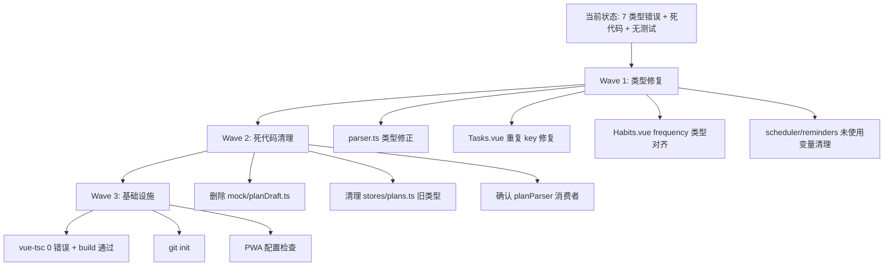

# Personal Workspace 改进计划

## 需求提炼

**用户原话**：现在做到这种程度，还有什么需要改进的，给我出个计划。

**目标**：对项目当前状态做全面审查，找出遗留的技术债务、类型错误、死代码、体验缺陷，制定修复优先级。

**非目标**：不加新功能——只修存量问题，让现有功能闭环跑通。

## 现状全景

经过全面扫描，当前项目有以下几类待改进项：

### A. 类型错误（vue-tsc 报 7 个错误，`npm run build` 的 `vue-tsc -b` 步骤失败）

| 文件 | 行 | 问题 | 严重度 |
|------|-----|------|--------|
| `src/services/parser.ts` | L47 | `scheduledDate` 类型 `string \| null` 赋给 `null` | 中 |
| `src/services/parser.ts` | L55 | `priority` 类型推断为 `"medium"` 而非联合类型 | 中 |
| `src/services/scheduler.ts` | L33 | `today` 声明未使用 | 低 |
| `src/stores/reminders.ts` | L40 | `base` 声明未使用 | 低 |
| `src/views/Habits.vue` | L12 | `frequency` 类型 `'daily' \| 'weekly'` 赋给 `'daily'` | 中 |
| `src/views/Tasks.vue` | L56,62 | 对象字面量重复 key（`'deferred'` 出现两次） | 高 |

### B. 死代码 / 无消费者文件

| 文件 | 状态 | 说明 |
|------|------|------|
| `src/mock/planDraft.ts` | 0 个消费者 | 旧 PlanDraft 类型已被 `src/types/planDraft.ts` 取代 |
| `src/stores/plans.ts` | `PlanDraft`/`PlanDraftTask` 接口 0 个消费者 | 旧类型定义已被取代，`Plan` 接口和 store 逻辑仍可保留 |
| `src/services/planParser.ts` 的 `parseToPlanDraft` | 需确认是否有消费者 | Inbox.vue 走的是 aiParser.ts 的 `parsePlan` |

### C. 数据模型不一致

| 问题 | 影响 |
|------|------|
| Task status 迁移映射中仍保留 `'today'`（已被 STATUS_MIGRATION 修正为 `'backlog'`），但 Tasks.vue 的 statusLabel/statusBadge 仍用 `'today'` 作为 key | 运行时不会匹配到任何任务 |
| Tasks.vue 有重复的 `'deferred'` key | 后者覆盖前者，但语义无差异 |
| Habits store 的 `frequency` 类型只有 `'daily'`，但 Habits.vue 传 `'daily' \| 'weekly'` | 类型不匹配 |

### D. PWA 构建警告

`vite-plugin-pwa:build` 的 `closeBundle` hook 报 `PLUGIN_ERROR`（非致命，build 仍 exit 0）。可能是 PWA manifest 配置或 service worker 注册问题。

### E. 体验缺陷

| 问题 | 影响 |
|------|------|
| 无 git 仓库（`.git` 不存在） | 所有改动无法版本管理 |
| 无测试框架（package.json 无 test 脚本、无 vitest 依赖） | 所有改动靠手动验证 |
| Tasks.vue 降级页面状态选项不含 `'backlog'` 的 label | 任务池标签可能显示异常 |

## 改进方案

### Wave 1: 类型修复（阻塞 build，最高优先级）

| 文件 | 操作 | 修复 |
|------|------|------|
| `src/services/parser.ts:45-55` | 修改 | `let scheduledDate: string \| null = defaultDate` → 声明为 `string`，resolveDate 返回 null 时保留默认值；`let priority` 声明为 `Task['priority']` |
| `src/views/Tasks.vue:55-63` | 修改 | 删除重复的 `'deferred'` key，删除不存在的 `'today'` key |
| `src/views/Habits.vue:12` | 修改 | `frequency` 类型改为 `'daily' \| 'weekly'` 或对齐 store 的类型定义 |
| `src/stores/habits.ts` | 修改 | Habit 接口的 `frequency` 字段加 `'weekly'` 到联合类型 |
| `src/services/scheduler.ts:33` | 修改 | 删除未使用的 `today` 变量 |
| `src/stores/reminders.ts:40` | 修改 | 删除未使用的 `base` 变量 |

**验证**：`npx vue-tsc --noEmit -p tsconfig.app.json` 输出 0 行

### Wave 2: 死代码清理（不阻塞，改善可维护性）

| 文件 | 操作 | 说明 |
|------|------|------|
| `src/mock/planDraft.ts` | 确认后保留/删除 | grep 确认 0 消费者后删除类型定义，如有 mock 数据引用则适配 |
| `src/stores/plans.ts:15-31` | 修改 | 删除 `PlanDraft`/`PlanDraftTask` 接口（已被 `src/types/planDraft.ts` 取代），保留 `Plan` 接口和 store |
| `src/services/planParser.ts` | 确认 | grep `parseToPlanDraft` 的消费者——如无直接消费者则标注为废弃 |

**验证**：`npx vue-tsc --noEmit -p tsconfig.app.json` 仍为 0 行 + `npx vite build` 成功

### Wave 3: 基础设施（可选，改善工程基线）

| 项目 | 操作 | 价值 |
|------|------|------|
| git init | 初始化版本控制 | 所有改动可追踪、可回滚 |
| `tsconfig.app.json` baseUrl 弃用 | 加 `"ignoreDeprecations": "6.0"` 或迁移到 `paths` 相对路径 | 消除 vue-tsc 的弃用警告 |
| PWA 插件配置检查 | 检查 `vite.config.ts` 中 PWA manifest 配置 | 消除 closeBundle hook 错误 |

## 验证清单

- [ ] `npx vue-tsc --noEmit -p tsconfig.app.json` 输出 0 行（类型零错误）
- [ ] `npm run build` 成功（含 `vue-tsc -b` 步骤）
- [ ] `npx vite build` 成功无 PLUGIN_ERROR
- [ ] 删除的文件无残留 import（grep 确认）
- [ ] 首页完成任务的闭环验证：首页变灰 → 目标进度增加 → 日历标记 → 复盘出现记录

## 反证 / 复现

| 断言 | 证据 |
|------|------|
| vue-tsc 报 7 个错误 | 本轮 `npx vue-tsc --noEmit -p tsconfig.app.json` 输出（7 行 error） |
| `vite build` 成功但 PWA hook 报错 | 本轮 `npx vite build` exit=0，日志末尾有 `PLUGIN_ERROR: vite-plugin-pwa:build` |
| Tasks.vue 有重复 key | `src/views/Tasks.vue:56` 和 `:62` 各有一个 `'deferred'` key（TS1117） |
| Habits.vue frequency 类型不匹配 | `src/views/Habits.vue:12` 传 `'daily' as const` 但 Habit 接口可能只有 `'daily'` |
| mock/planDraft.ts 0 消费者 | 本轮 grep `from '@/mock/planDraft'` 返回 0 匹配 |

**待验证假设**：
- `parseToPlanDraft` 是否有直接消费者——需 grep 确认（计划期未查）
- Habit 接口的 frequency 字段实际类型——需 read `src/mock/habits.ts` 确认

## 回归清单

- [ ] Inbox.vue AI 规划功能正常（解析 → 层级预览 → 确认创建）
- [ ] 首页任务完成/取消完整闭环
- [ ] 目标页面删除不闪退
- [ ] 复盘页面显示昨天数据
- [ ] 日历 Widget 显示今日活动标记
