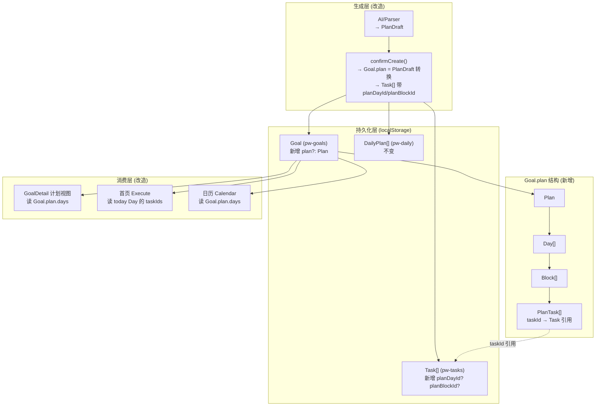

# P24 重构目标计划系统：Goal 管理时间规划

## 需求提炼

**用户原话目标**：让 Goal 不再直接管理任务，而是管理一个有时间规划的执行计划。数据结构：Goal → Plan → Days[] → Blocks[] → Tasks[]。

**五项硬需求**：
1. Goal 详情页增加「计划视图」
2. 原来的关联任务改为隐藏的任务池
3. AI 生成目标时必须生成：目标 / 周期 / 每日安排 / 任务
4. 首页只读取今天对应 Day 任务
5. 日历读取 Plan.days

**约束**：不要删除旧 Task 逻辑，先兼容迁移。

**非目标**：
- 不改造习惯、专注、日志等其他模块
- 不改造 DailyPlan（`pw-daily`）的数据结构——它是今日执行的物理载体，Plan 是规划视角
- 不改变 Task 的字段结构（只新增 `planDayId`/`planBlockId` 可选关联字段）

## 现状分析

### 已有的层级结构（可直接复用）

代码库**已经有** Goal→Days→Blocks→Tasks 的完整类型定义 `PlanDraft`（`src/types/planDraft.ts:41`），包含 `DraftDay`/`DraftBlock`/`DraftTask` 三个层级类型。但它只作为 **AI 生成的临时草稿**存在：

- `Inbox.vue` 调用 `aiParseToPlanDraft()` 或 `parsePlan()` 生成 PlanDraft → 存入 `planDraftStore.currentDraft`
- `Inbox.vue` 展示层级预览（可编辑）
- `planDraftStore.confirmCreate()`（`src/stores/planDraft.ts:88`）把 PlanDraft **拍扁**：创建 Goal + 批量创建 Task + 写入 DailyPlan → **Day/Block 层级信息全部丢弃**
- 之后的 Goal 详情页只通过 `task.goalId` 读 Task 列表，看不到任何 Day/Block 结构

### 当前任务流转链路（必须保持兼容）

```
AI 生成 → PlanDraft(临时) → confirmCreate() → Goal + Task[] + DailyPlan
                                                        ↑
手动创建 Goal → 手动添加 Task(goalId) ───────────────────┘
                                                        ↑
手动创建 Task(TaskModal) → 可选绑定 goalId ──────────────┘
                                                        ↑
首页(Execute) ← todayPlan.taskIds (DailyPlan) + Task.status=doing
日历(Calendar) ← Task.scheduledDate / Task.completedAt
scheduler.ts ← Task(backlog+deferred) → 按多因子排序 → 写入 DailyPlan
```

### 关键发现：confirmCreate 已存在 Day→DailyPlan 映射

`planDraft.ts:113-130` 中 `confirmCreate` 已经做了 Day.date → DailyPlan 的映射（`dailyStore.addTaskToDate(taskId, day.date)`）。也就是说**任务的执行日期已来自 PlanDraft 的 Day.date**——但映射后 Day 的结构信息（标题、block 分类、block 内任务顺序）就丢了。

## 架构设计

### 核心决策：Plan 嵌入 Goal，持久化 PlanDraft 结构



### 数据模型定义

在 `src/mock/goals.ts` 中新增 Plan 类型（复用 PlanDraft 的子结构，但持久化版去掉 `selected` 等临时字段）：

```typescript
/** 计划中的任务引用（指向 TaskStore 中的真实 Task） */
export interface PlanTask {
  taskId: string       // 引用 Task.id
  title: string        // 冗余快照（Task 删除时可保留标题）
  priority: Priority
  estimatedMinutes?: number
}

/** 时间块（上午/下午/学习/项目等） */
export interface PlanBlock {
  id: string
  category: string         // '学习' | '项目' | '复盘' | '运动'...
  time?: string            // 'HH:MM' 或 '上午'/'下午'
  tasks: PlanTask[]
}

/** 每日计划 */
export interface PlanDay {
  id: string
  day: number              // 第几天 (1-based)
  date: string             // YYYY-MM-DD
  title: string            // "Day1：JavaScript 核心"
  blocks: PlanBlock[]
}

/** 执行计划（嵌入 Goal） */
export interface Plan {
  days: PlanDay[]
  startDate: string
  totalDays: number
}
```

Goal 接口新增可选字段：
```typescript
export interface Goal {
  // ...现有字段不变
  plan?: Plan              // 新增：有时间规划的计划
}
```

Task 接口新增可选字段（向后兼容）：
```typescript
export interface Task {
  // ...现有字段不变
  planDayId?: string       // 新增：关联到 Goal.plan 中的 Day
  planBlockId?: string     // 新增：关联到 Goal.plan 中的 Block
}
```

### 兼容迁移策略

Goal 的 `load()` 函数已有迁移模式（`goals.ts:14-22` 做 priority 迁移 + 过期标记）。新增 plan 字段迁移：
- 旧 Goal（无 plan 字段）→ `plan` 为 undefined，GoalDetail 仍展示旧「任务池」视图
- 新 Goal（AI 生成）→ `plan` 有值，GoalDetail 展示「计划视图」+ 隐藏的任务池
- 旧 Task（无 planDayId）→ 不影响，仍通过 goalId 关联

**不删除任何旧逻辑**——`goalTaskCount`/`goalDoneCount`/`goalProgress` 继续通过 task.goalId 计算，新旧 Goal 都兼容。

### 五项需求落点

| 需求 | 落点文件 | 改造方式 |
|------|----------|----------|
| ① Goal 详情页计划视图 | `GoalDetail.vue` | 新增 Tab 切换：计划视图 / 任务池。计划视图读 `goal.plan.days` 渲染 Day→Block→Task 层级 |
| ② 关联任务→隐藏任务池 | `GoalDetail.vue` | 现有「关联任务」区域保留但默认折叠，标题改为「任务池」 |
| ③ AI 生成必须含四要素 | `planDraft.ts confirmCreate()` | 改造：不再拍扁，而是把 PlanDraft 转为 Plan 嵌入 Goal，Task 带 planDayId/planBlockId |
| ④ 首页读今天 Day 任务 | `goals.ts` 新增 `todayDayTasks()` | Execute.vue 的 todayTasks 增加 Plan 来源：找所有 active Goal 中 plan.days 里 date===today 的 taskIds |
| ⑤ 日历读 Plan.days | `Calendar.vue` | 日期统计增加 Plan 维度：遍历 Goal.plan.days 找 date 匹配的任务 |

### 关键改造点详解

#### 改造 1: `planDraft.ts confirmCreate()` — 持久化层级

当前（`planDraft.ts:88-134`）：拍扁成 Goal + Task[] + DailyPlan。
改造后：
1. 创建 Goal 时，把 PlanDraft.days 转为 Plan.days（PlanTask 只存 taskId 引用 + 冗余字段）
2. 创建 Task 时，写入 `planDayId`/`planBlockId`
3. DailyPlan 映射保持不变（`dailyStore.addTaskToDate` 仍按 day.date 写入）

#### 改造 2: `goals.ts` — 新增 Plan 查询方法

```typescript
/** 获取 Goal 计划中指定日期的所有 taskIds */
function goalDayTaskIds(goalId: string, date: string): string[] {
  const g = goals.value.find((g) => g.id === goalId)
  if (!g?.plan) return []
  const day = g.plan.days.find((d) => d.date === date)
  if (!day) return []
  return day.blocks.flatMap((b) => b.tasks.map((t) => t.taskId))
}

/** 获取所有 active Goal 中指定日期的 taskIds（首页用） */
function allGoalDayTaskIds(date: string): string[] {
  return activeGoals.value.flatMap((g) => goalDayTaskIds(g.id, date))
}
```

首页 Execute.vue 的 `todayTasks` computed 增加 Plan 来源：在现有 DailyPlan + Task.status=doing 双源基础上，增加第三源 `goalStore.allGoalDayTaskIds(today)`。

#### 改造 3: GoalDetail.vue — Tab 切换

新增 `activeTab: ref<'plan' | 'pool'>('plan')`。有 plan 时默认 plan tab，无 plan 时默认 pool tab。
- 计划视图：渲染 Day → Block → PlanTask 层级，点击 PlanTask 的 checkbox 调用 `taskStore.toggleTask(taskId)`
- 任务池（折叠）：保留现有逻辑

#### 改造 4: Calendar.vue — Plan 维度

日历的 `dayDots()` 和 `selectedTasks` 增加 Plan 来源：遍历所有 Goal.plan.days，找 date 匹配的任务统计。

### 进度计算保持统一

Goal 进度仍通过 `goalProgress(goalId)` 计算（task.goalId + status=done 的比例）。Plan 视图中的完成状态通过 taskId → TaskStore 查询真实 status。PlanTask 不维护独立的完成状态——**单一数据源是 TaskStore**。

## 实施波次

### Wave 1: 类型 + 数据模型（基础层）
- `src/mock/goals.ts`：新增 Plan/PlanDay/PlanBlock/PlanTask 类型，Goal 新增 plan? 字段
- `src/mock/tasks.ts`：Task 新增 planDayId?/planBlockId? 字段
- 验证：`tsc --noEmit` 通过

### Wave 2: Store 层改造（逻辑层）
- `src/stores/planDraft.ts`：改造 confirmCreate() 持久化层级到 Goal.plan
- `src/stores/goals.ts`：新增 goalDayTaskIds() / allGoalDayTaskIds() 查询方法，新增 plan 相关计算
- 验证：`tsc --noEmit` 通过

### Wave 3: 视图层改造（表现层）
- `src/views/GoalDetail.vue`：新增计划视图 Tab + 任务池折叠
- `src/views/Execute.vue`：todayTasks 增加 Plan 来源
- `src/views/Calendar.vue`：统计增加 Plan 维度
- 验证：`tsc --noEmit` + `npm run build` 通过

### Wave 4: 测试验证
- 验证迁移：旧数据（无 plan）正常加载
- 验证 AI 生成：PlanDraft → Goal.plan 完整保留
- 验证首页：今天 Day 任务正确显示
- 验证日历：Plan.days 正确映射

## 反证/复现

### 已验证的现状断言

1. **PlanDraft 层级结构已存在** — 证据：`src/types/planDraft.ts:41-54`，`DraftDay`/`DraftBlock`/`DraftTask` 类型完整定义，`flattenTasks()`/`dayTasks()` 辅助函数存在
2. **confirmCreate 拍扁丢弃层级** — 证据：`src/stores/planDraft.ts:88-134`，遍历 days→blocks→tasks 只创建 Task，不保留 Day/Block 结构
3. **首页今日任务双源** — 证据：`src/views/Execute.vue:129-135`，`todayTasks` = DailyPlan.taskIds ∪ Task.status=doing
4. **日历靠 Task.scheduledDate** — 证据：`src/views/Calendar.vue:76-79`，`dayDots()` 和 `selectedTasks` 均基于 `task.scheduledDate` / `task.completedAt`
5. **Goal 进度通过 goalId 查 Task** — 证据：`src/stores/goals.ts:120-138`，`goalTaskCount`/`goalDoneCount`/`goalProgress` 全部基于 `taskStore.tasks.filter(t => t.goalId === goalId)`

### 设计假设（待验证）

- **假设：PlanTask 不需要独立 status** — 进度统一从 TaskStore 查。风险：如果用户在计划视图勾选完成，必须通过 taskId 找到 Task 并 toggle。已确认 GoalDetail.vue 中 toggle 操作会走 `taskStore.toggleTask(t.id)`，路径通畅。
- **假设：旧 Goal 无 plan 时不影响首页** — allGoalDayTaskIds 对无 plan 的 Goal 返回空数组，不会报错。**待 Wave 4 验证**。
- **假设：Task 新增可选字段不破坏 load** — tasks.ts 的 `loadTasks()` 用扩展运算符 `...t`，新字段自动透传。**待 Wave 4 验证**。

### 迁移安全验证

确认 `goals.ts:14-22` 的 load() 已有迁移模式（priority 字段迁移），新增 plan 字段迁移走同一模式：旧数据 plan 为 undefined → `g.plan || undefined`，不需要显式迁移代码（可选字段天然兼容）。

## 风险

1. **localStorage 数据膨胀**：Goal.plan 可能较大（14天×3块×5任务 = 210 个 PlanTask）。单个 Goal 约 10-20KB，可接受。
2. **Day.date 与 Task.scheduledDate 冗余**：AI 生成时两者一致（confirmCreate 已做 `dueDate: day.date, scheduledDate: day.date`），但用户后续编辑可能产生不一致。设计选择：以 Task.scheduledDate 为执行真值，Plan.day.date 为规划真值，两者解耦。
3. **删除 Goal 时 Plan 的级联**：现有 `deleteGoal('cascade')` 已处理 Task 级联，Plan 随 Goal 一起删除，无需额外处理。
