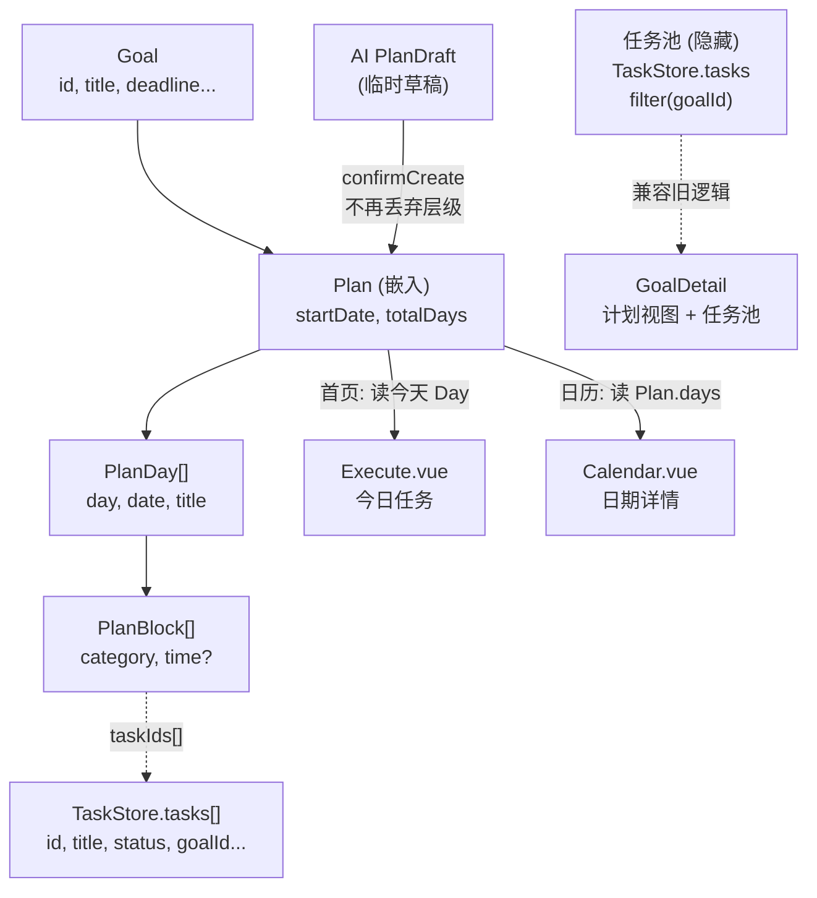

> **Model: glm-5.2**

> **Status: APPROVED** — 2026-07-30T16:29:35.393Z

# P24 重构目标计划系统：Goal 管理 Plan 而非直接管理 Task

## 需求提炼

用户原话：
> 让 Goal 不再直接管理任务，而是管理一个有时间规划的执行计划。
> 新的数据结构：Goal → Plan → Days[] → Blocks[] → Tasks[]
> 要求：
> 1. Goal 详情页增加「计划视图」
> 2. 原来的关联任务改为隐藏的任务池
> 3. AI 生成目标时必须生成：目标 / 周期 / 每日安排 / 任务
> 4. 首页只读取今天对应 Day 任务
> 5. 日历读取 Plan.days
> 不要删除旧 Task 逻辑，先兼容迁移。

目标：Goal 持久化管理一个分层 Plan（Day→Block→Task 引用），AI 生成的层级结构不再在 confirmCreate 时丢弃，首页和日历改为从 Plan.days 读取而非从扁平 Task/DailyPlan 读取。

非目标：
- 不改 Task 的核心 CRUD（toggle/defer/complete 逻辑不变）
- 不改 Focus / Habit / Journal / Reminder 模块
- 不改 scheduler.ts 的多因子排序算法本身（只改它的数据读取入口）
- 不一次性迁移全部旧 Goal——旧 Goal 无 plan 字段时走兼容路径

## 架构现状（调研结论）

### 已有的层级结构
代码库已经有完整的 Goal→Days→Blocks→Tasks 类型定义（`src/types/planDraft.ts`），但它是 AI 生成时的**临时草稿**：
- `PlanDraft` 类型：goal{title,description} + days[] + startDate + totalDays
- `DraftDay`：day / date / title / blocks[]
- `DraftBlock`：category / time? / tasks[]
- `DraftTask`：title / priority / selected / category / estimatedMinutes?

问题出在 `planDraft.ts` store 的 `confirmCreate()`（src/stores/planDraft.ts:89-145）：它遍历 days→blocks→tasks，为每个 task 创建一条 Task 记录（绑 goalId）并写入 DailyPlan，**但 PlanDraft 层级结构本身被丢弃**（`clearDraft()` 调用在第 143 行）。Day 的日期安排、Block 的时间块分组——这些信息在落地后全部丢失。

### 消费端现状（5 个入口）
1. **首页 Execute.vue**（src/views/Execute.vue:101-108）：今日任务来自 `dailyStore.todayPlan.taskIds` ∪ `taskStore.todayTasks`（status=doing），两者都指向扁平 Task。与 Plan 无关。
2. **日历 Calendar.vue**（src/views/Calendar.vue:60-67）：按 `task.scheduledDate` / `task.completedAt` 过滤 Task。与 Plan 无关。
3. **GoalDetail.vue**（src/views/GoalDetail.vue:35-37）：按 `t.goalId === goalId` 过滤 Task，展示为"关联任务"列表。
4. **Goals.vue 列表页**（src/views/Goals.vue）：两步创建流程（form → tasks），手动添加扁平任务。
5. **Inbox.vue**（src/views/Inbox.vue）：AI 规划入口，展示 PlanDraft 层级预览 → confirmCreate → 拍扁。

### DailyPlan 的角色
`DailyPlan`（src/mock/daily.ts + src/stores/daily.ts）按日期存储 taskId 列表。它是当前"今天做什么"的唯一来源。重构后 Plan.days 自带日期+任务引用，可以取代 DailyPlan 对 Plan 任务的索引作用——但为兼容非 Plan 任务（手动添加的），DailyPlan 保留。

## 目标数据模型

```
Goal
 ├─ (现有字段：id, title, category, description, startDate, deadline, progress, priority, status)
 └─ plan?: Plan                    // 新增，可选——旧 Goal 无此字段，走兼容路径
      ├─ startDate: string          // 计划起始日
      ├─ totalDays: number
      └─ days: PlanDay[]
           ├─ day: number            // 第几天 (1-based)
           ├─ date: string           // YYYY-MM-DD
           ├─ title: string          // "Day1：JavaScript 作用域"
           └─ blocks: PlanBlock[]
                ├─ category: string  // "学习" | "上午" 等
                ├─ time?: string     // "HH:MM" 或 "上午"/"下午"
                └─ taskIds: string[] // 引用 TaskStore 中的 Task.id
```

关键设计决策：
- **Plan 嵌入 Goal 而非独立 Store**：Plan 是 Goal 的执行蓝图，1:1 关系，生命周期一致。独立 Store 带来同步复杂度无收益。
- **Block 存 taskIds 而非内嵌 Task**：Task 的状态（done/deferred）、toggle/defer 操作已有完整 store 逻辑。Plan 只管"什么时候做什么"的编排骨架，Task 实体仍由 TaskStore 管理。这样 toggle 一个任务，Plan 视图和任务池自动同步。
- **Plan 复用 DraftDay/DraftBlock 的字段结构**：但 taskIds 替代 tasks[]，因为 Task 实体在 TaskStore。类型定义在 `src/types/plan.ts` 新文件。



## 迁移与兼容策略

1. **旧 Goal 兼容**：Goal.plan 为 undefined 时，GoalDetail 退化为当前行为（按 goalId 过滤 Task 展示）。首页/日历不受影响（它们现在就不依赖 Plan）。
2. **Task 池保留**：所有 Task 仍在 TaskStore，goalId 绑定不变。Plan 只是新增的编排层。"隐藏的任务池"= GoalDetail 中折叠/次要展示的按 goalId 过滤的 Task 列表。
3. **DailyPlan 保留**：手动添加的任务、非 Plan 路径仍用 DailyPlan。Plan 任务的"今天做什么"改为从 Plan.days[today] 读取 taskIds。
4. **confirmCreate 改造**：不再丢弃 PlanDraft 层级，而是将 days/blocks 结构转为 Plan 存入 Goal.plan，同时仍创建 Task（保持 TaskStore 不变）。

## 实施波次

### Wave 1：类型与数据层（基础设施）
文件：`src/types/plan.ts`（新建）、`src/mock/goals.ts`、`src/stores/goals.ts`

- [x] 新建 `src/types/plan.ts`：定义 PlanDay、PlanBlock、Plan 接口 + 工具函数（getDayByDate、getTodayDay、flattenPlanTaskIds）
- [x] `src/mock/goals.ts`：Goal 接口加 `plan?: Plan`，mockGoals 不变（旧数据无 plan）
- [x] `src/stores/goals.ts`：load() 迁移保留旧字段 + plan 透传
- [x] `src/stores/goals.ts`：新增 `goalPlan(goalId)` / `goalTodayTasks(goalId)` / `goalPlanProgress(goalId)` 方法
- [x] `src/stores/goals.ts`：deleteGoal cascade 时清理 Plan 中的 taskId 引用

验证：`tsc --noEmit` 通过

### Wave 2：AI 生成落地改造
文件：`src/stores/planDraft.ts`

- [x] `src/stores/planDraft.ts` confirmCreate()：创建 Task 后将 PlanDraft.days/blocks 转为 Plan 结构（taskIds 引用已创建的 Task.id），存入 Goal.plan
- [x] 不再丢弃层级——clearDraft() 仍清理草稿，但 Plan 已存入 Goal

验证：`tsc --noEmit`；手动验证——AI 生成后 Goal.plan 有值

### Wave 3：GoalDetail 计划视图
文件：`src/views/GoalDetail.vue`

- [ ] 新增「计划视图」区域：若 goal.plan 存在，按 Day→Block 展示层级，每个 Block 内按 taskIds 查 Task 展示标题+完成状态
- [ ] 原关联任务列表改为折叠的「任务池」区域（默认折叠，点击展开）
- [ ] 进度面板：优先用 Plan 进度，无 Plan 时用旧的 goalProgress

验证：`tsc --noEmit`；构建通过

### Wave 4：首页读今天 Day
文件：`src/views/Execute.vue`、`src/stores/goals.ts`

- [ ] Execute.vue todayTasks 合并两源：(a) DailyPlan（手动/兼容任务）(b) 所有 Goal.plan 中 date=today 的 taskIds
- [ ] 不改 scheduler.ts 排序逻辑，只改候选池来源
- [ ] 保留 DailyPlan 读取（兼容非 Plan 任务）

验证：`tsc --noEmit`

### Wave 5：日历读 Plan.days
文件：`src/views/Calendar.vue`

- [ ] 日历日期详情：选中日期的 Task 列表增加 Plan 来源——遍历所有 Goal.plan.days，找 date=selectedDate 的 taskIds
- [ ] 状态点逻辑不变（仍基于 Task.scheduledDate/completedAt，Plan 任务 confirmCreate 时 scheduledDate 已赋值）

验证：`tsc --noEmit`；`npm run build`

## 反证/复现

### 关键断言验证
1. **"confirmCreate 丢弃层级"** — 证据：src/stores/planDraft.ts:143 `clearDraft()` 在 return result 之前调用，currentDraft 置 null，PlanDraft 结构不持久化。验证方式：read_file 已确认。
2. **"首页不依赖 Plan"** — 证据：src/views/Execute.vue:101-108 todayTasks 来自 dailyStore.todayPlan.taskIds ∪ taskStore.todayTasks，两者都查 Task，无 Plan 引用。验证方式：read_file 已确认。
3. **"日历不依赖 Plan"** — 证据：src/views/Calendar.vue:60-67 按 task.scheduledDate 过滤。验证方式：read_file 已确认。
4. **"GoalDetail 按 goalId 过滤 Task"** — 证据：src/views/GoalDetail.vue:35 `taskStore.tasks.filter((t) => t.goalId === goalId.value)`。验证方式：read_file 已确认。

### 回归风险
- **localStorage 旧数据**：旧 Goal 无 plan 字段 → Goal.plan 为 undefined → 所有新逻辑用 `?.` 和 `if (goal.plan)` 守卫。load() 不会因缺字段崩溃（spread 操作保留已有字段）。
- **Task.goalId 绑定不变**：Plan 的 taskIds 与 Task.goalId 双重绑定。删除任务时需同步清理 Plan 中的 taskId 引用（deleteGoal cascade 已清理 Task，需补 Plan 引用清理）。
- **typecheck 覆盖**：每个 Wave 都跑 `tsc --noEmit`，接口变更的消费方由 TS 编译器强制检查。

### 测试策略
此项目无测试框架（无 jest/vitest 配置，npm test 待确认）。验证依赖：
- `tsc --noEmit`：类型安全（每个 Wave 必跑）
- `npm run build`：构建通过（Wave 5 跑全量）
- 手动验证：AI 生成 → GoalDetail 计划视图 → 首页今日任务 → 日历（需 dev server，标记为"运行时未实测"）
